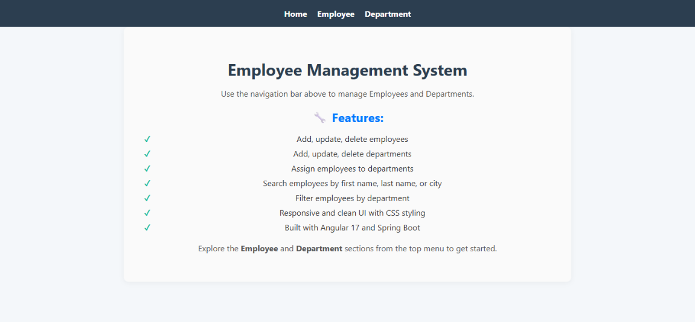
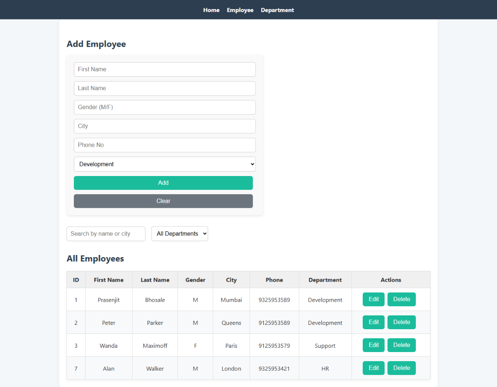
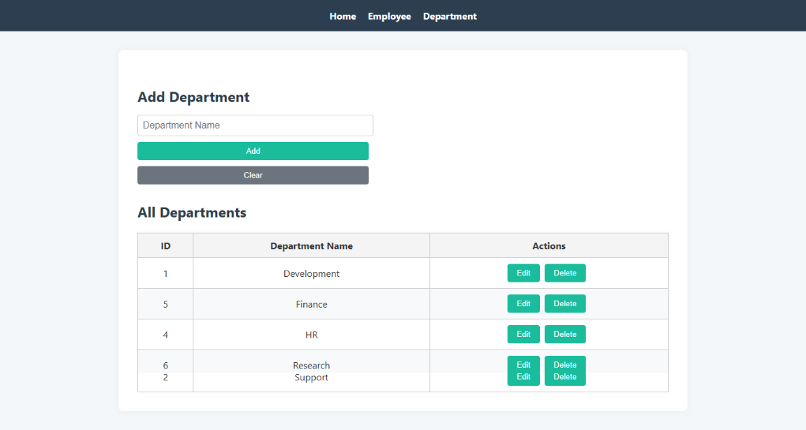

# 🧑‍💼 Employee Management System

A full-stack web application for managing employees and departments, built using **Spring Boot** (backend) and **Angular 17** (frontend). The system supports full CRUD operations, filtering, and search functionality.

---

## 📸 Screenshots

| Dashboard | Add Employee | Filter/Search |
|----------|---------------|----------------|
|  |  |  |

---

## 🛠️ Tech Stack

- **Frontend:** Angular 17 (--no-standalone) , TypeScript, HTML, CSS
- **Backend:** Java, Spring Boot, Spring Data JPA, REST API
- **Database:** MySQL
- **Tools:** Postman, Git, Eclipse IDE

---

## ✨ Features

- ✅ Add, update, delete employees
- ✅ Add, update, delete departments
- 🔍 Search employees by name or city
- 🎯 Filter employees by department
- 🔗 Angular-Spring Boot integration
- 📬 RESTful API with Postman collections

---

## 📦 How to Run

### 🔧 Backend (Spring Boot - Eclipse)

1. Open **Eclipse IDE**
2. Go to: `File > Import > Maven > Existing Maven Projects`
3. Select the `employeeTest` directory
4. Wait for dependencies to load
5. Right-click `EmployeeTestApplication.java` → **Run As > Java Application**

> ✅ Ensure MySQL is running and credentials are configured in:
> `employeeTest/src/main/resources/application.properties`

---

### 🌐 Frontend (Angular)

```bash
cd Employee-Test-Frontend
npm install
ng serve
